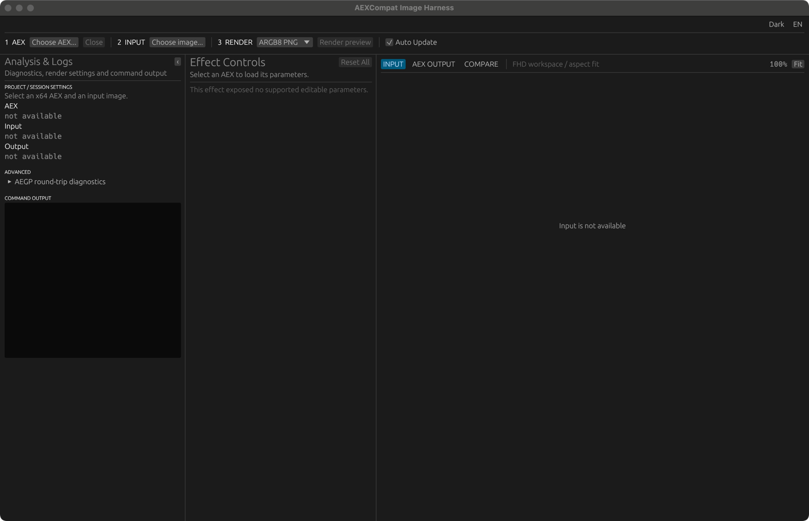

# AEXCompat

**After Effects用の`.aex`プラグインをAfter Effects本体の外で読み込み・描画・デバッグする互換ホスト。**

[English](README.en.md) · [クイックスタート](#クイックスタート) · [ドキュメント](#ドキュメント) · [ライセンス](#ライセンス)

<p align="center">
  
</p>

WindowsとApple Siliconで共通化を進めているRust/egui GUIです。AEXの選択、Effect Controls、入力・出力比較、診断ログを1つの画面で扱います。

## AEXCompatとは

AEXCompatは、Windows x64の`.aex`プラグインへ画像や音声を入力し、結果の表示・保存・診断を行うクリーンルーム互換ホストです。

- WindowsではRust製desktop harnessとC++/MSVC workerを使用
- Apple Silicon Macではarm64 Unicorn workerがWindows x64 AEXをguest実行
- Effect Controls、Classic Render、SmartFX、ARGB8/16/32Fに対応
- selector、Suite、parameter、crash、hangをstructured diagnosticとして記録
- After Effects実機の参照画像とpixel比較可能

After Effects全体、AEP編集環境、AEGP host全体の再実装は目的としていません。

| Platform | 実行経路 |
|---|---|
| Windows x64 | desktop harness + native C++/MSVC worker |
| Apple Silicon | arm64 Unicorn workerによるWindows x64 guest実行 |

## クイックスタート

### Apple Silicon Mac

Rust/Cargoだけでarm64 workerのRelease build、ad-hoc署名、DMG作成、mount後の検証まで実行できます。Windows、Rosetta、Adobe証明書は不要です。

```sh
git clone https://github.com/onmokoworks/AEXCompat.git
cd AEXCompat
tools/prepare-local-macos-aex-carriers.sh /tmp/aexcompat-local.dmg
```

手元のAEXとPNGを実際にrenderする場合:

```sh
AEXCOMPAT_SMOKE_AEX=/absolute/path/to/effect.aex \
AEXCOMPAT_SMOKE_INPUT_PNG=/absolute/path/to/input.png \
  tools/prepare-local-macos-aex-carriers.sh /tmp/aexcompat-local-smoke.dmg
```

AEXと入力画像はDMGへ収録されません。通常経路はarm64 Unicornのみです。Rosetta native carrierはtrusted AEX向けの任意経路で、`AEXCOMPAT_INCLUDE_NATIVE_CARRIER=1`を指定した場合だけ追加されます。

### Windows

必要なもの:

- Windows 10/11 x64
- Rust/Cargo
- Visual StudioまたはBuild Tools（MSVC C++ toolchain + Windows SDK）
- CMake

GUIを起動:

```powershell
git clone https://github.com/onmokoworks/AEXCompat.git
cd AEXCompat\broker
cargo run -p aexcompat-harness
```

AEXのinspect/renderには`minihost/` workerのbuildも必要です。Adobe SDKはprobeやSDK fixtureのbuild時だけ必要です。正確なコマンドとtoolsetは[Build Requirements](docs/BUILD_REQUIREMENTS.md)を参照してください。

## 使い方

1. AEXを選択する
2. 自動実行された`PF_PARAMS_SETUP`からEffect Controlsを生成する
3. 入力画像とparameterを指定する
4. **Render current frame**または**Render and save PNG**を実行する
5. viewerで入力とAEX出力を比較する

対応入力はPNG、JPEG、BMP、TIFF、WebP、出力はPNGです。複数Layer、time/FPS、downsample、pixel aspect、sequence state、mono float32 audioも扱えます。

## アーキテクチャ

```text
Desktop Harness / CLI
        ↓
Rust Broker（入力検証・staging・provenance）
        ↓
Isolated Worker Process
        ↓
Clean-room Effect Host（selectors・PF worlds・Suites）
        ↓
AEX → image / audio / diagnostics
```

| ディレクトリ | 役割 |
|---|---|
| `broker/` | Rust broker、desktop harness、隔離起動 |
| `minihost/` | AE Effect ABIとPF Suiteを提供するC++ worker |
| `guest/` | Apple Silicon上でWindows x64 AEXを動かすguest worker |
| `instruments/` | SDK ABI、Suite、selectorを測定するprobe AEX |
| `tests/` | 契約、境界、回帰、fail-closedテスト |
| `analysis/` | AE oracleとruntime evidence |

## テスト

```powershell
uv sync --locked
cargo test --manifest-path broker\Cargo.toml --workspace
uv run python -m pytest -q
```

SDK、build artifact、machine-bound evidenceを使う検証は明示opt-inです。公開repositoryとforkのCIはsource-onlyで実行し、Adobe SDKは取得・再配布しません。全matrixと環境要件は[Build Requirements](docs/BUILD_REQUIREMENTS.md)にあります。

## 現在の制限

- 未対応Suiteやeffect固有のhost前提で停止する場合があります
- worker完走、画像生成、AEとのpixel一致はそれぞれ別の到達段階です
- custom UI、GPU backend、pixel depth、複数入力、sequence semanticsはAEXごとに異なります

## ドキュメント

| 内容 | 文書 |
|---|---|
| Build、SDK、CI要件 | [Build Requirements](docs/BUILD_REQUIREMENTS.md) |
| 互換性の現在地 | [Compatibility Status](docs/COMPATIBILITY_STATUS_2026-07-16.md) |
| 方向性とroadmap | [Project Direction](docs/PROJECT_DIRECTION.md) |
| MacでのAEX検証方法と日付付き結果 | [macOS Unicorn Corpus Metrics](docs/MACOS_UNICORN_CORPUS_METRICS.md) |
| AEX移植・解析 | [AEX Porting Dossier](docs/aex-porting-dossier.md) |
| Windows native hardening | [Windows Native Hardening Plan](docs/WINDOWS_NATIVE_HARDENING_PLAN_2026-07-16.md) |
| AE oracleの別machine取得 | [AE Oracle Cross-Machine Runbook](docs/AE_ORACLE_CROSS_MACHINE_RUNBOOK_2026-07-18.md) |
| 公開・第三者material境界 | [Public Release Audit](docs/PUBLIC_RELEASE_AUDIT.md) |
| 脆弱性報告 | [Security Policy](SECURITY.md) |
| 開発・投稿ルール | [Contributing](CONTRIBUTING.md) |

ほかの設計・検証文書は[文書索引](docs/README.md)から探せます。

## Contributing

互換機能は、実際のAEX、SDKのサンプル、自作の検証用AEXで動作の違いを再現してから追加します。特定のAEXだけに通用する処理ではなく、一般化した最小限のホスト機能として実装し、対象を絞ったテストと境界値の検証を行います。可能であればAfter Effects実機の結果とも比較します。

非公開・市販のAEX、Adobe SDK、DLL、メモリダンプ、非公開の素材や検証データ、秘密情報、個人のファイルパスをIssueやPRへ投稿しないでください。

## ライセンス

AEXCompatの開発者が権利を持つ部分は、[Mozilla Public License 2.0](LICENSE)で提供します。第三者の成果物、Adobe SDK、非公開AEXにはそれぞれの権利・利用条件が適用されます。Unicorn Engineを含む実行ファイルの配布条件、依存関係の告知、公開前の確認事項は[Public Release Audit](docs/PUBLIC_RELEASE_AUDIT.md)を参照してください。

Adobe、After Effectsおよび関連製品名は各権利者の商標であり、本プロジェクトはAdobe公式ではありません。
