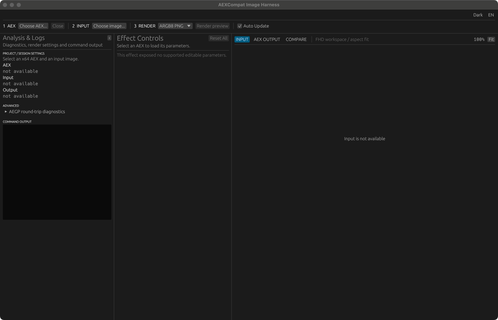

# AEXCompat

After Effects用の`.aex`プラグインを、After Effects本体の外で読み込み・描画・デバッグする互換ホストです。

[English](README.en.md) · [クイックスタート](#クイックスタート) · [ドキュメント](#ドキュメント) · [ライセンス](#ライセンス)

<p align="center">
  
</p>

Rust/egui製のGUIで、AEXの選択、Effect Controls、入力・出力の比較、診断ログの確認ができます。WindowsとApple Silicon MacでGUIの共通化を進めています。

## AEXCompatとは

AEXCompatは、Windows x64の`.aex`プラグインに画像や音声を入力し、結果を表示・保存・診断するクリーンルーム互換ホストです。

- Effect Controls、Classic Render、SmartFX、ARGB8/16/32Fに対応
- selector、Suite、パラメーター、クラッシュ、ハングに関する情報を、構造化した診断ログとして記録
- After Effects実機で取得した参照画像とピクセル単位で比較

After Effects全体、AEP編集環境、AEGPホスト全体の再実装は目的としていません。

| 環境 | 実行経路 |
|---|---|
| Windows x64 | Rust製desktop harness + ネイティブC++/MSVC worker |
| Apple Silicon | arm64 Unicorn workerでWindows x64 AEXをゲスト実行 |

## クイックスタート

### Windows

GUIをソースからビルド・起動するには、次の環境が必要です。

- Windows 10/11 x64
- Rust/Cargo
- Visual StudioまたはBuild Tools（MSVC C++ツールチェーン + Windows SDK）

次のコマンドでGUIをビルドして起動できます。

```powershell
git clone https://github.com/onmokoworks/AEXCompat.git
cd AEXCompat\broker
cargo run -p aexcompat-harness
```

AEXの解析・描画には、`minihost/`のworkerも別途ビルドしてください。workerのビルドには、上記の環境に加えてCMakeが必要です。Adobe SDKが必要なのは、計測用のprobeやSDKサンプルの検証用プラグインをビルドする場合だけです。具体的なコマンドとツールセットの要件は[Build Requirements](docs/BUILD_REQUIREMENTS.md)を参照してください。

### Apple Silicon Mac（補助経路）

Rust/Cargoだけで、arm64 workerのReleaseビルド、ad-hoc署名、DMG作成、マウント後の検証まで実行できます。この通常経路ではWindowsとRosettaは不要です。

```sh
git clone https://github.com/onmokoworks/AEXCompat.git
cd AEXCompat
tools/prepare-local-macos-aex-carriers.sh /tmp/aexcompat-local.dmg
```

手元のAEXとPNGを使って描画を検証する場合は、両方の絶対パスを指定してください。

```sh
AEXCOMPAT_SMOKE_AEX=/absolute/path/to/effect.aex \
AEXCOMPAT_SMOKE_INPUT_PNG=/absolute/path/to/input.png \
  tools/prepare-local-macos-aex-carriers.sh /tmp/aexcompat-local-smoke.dmg
```

AEXと入力画像はDMGに収録されません。通常はarm64 Unicornのみを使います。Rosetta native carrierは、信頼できるAEX向けの任意の実行経路です。`AEXCOMPAT_INCLUDE_NATIVE_CARRIER=1`を指定した場合だけ追加されます。

## 使い方

1. AEXを選択する
2. 自動実行される`PF_PARAMS_SETUP`の結果から、Effect Controlsが生成される
3. 入力画像とパラメーターを指定する
4. **Render current frame**または**Render and save PNG**を実行する
5. ビューアーで入力とAEXの出力を比較する

入力画像はPNG、JPEG、BMP、TIFF、WebPに対応し、出力形式はPNGです。複数レイヤー、時間/FPS、ダウンサンプル、ピクセルアスペクト比、シーケンス状態、モノラルのfloat32音声も扱えます。

## アーキテクチャ

```text
Desktop Harness / CLI
        ↓
Rust Broker（入力検証・staging・provenance）
        ↓
Isolated Worker Process
        ↓
Clean-room Effect Host（selectors・PF worlds・Suites）
        ↓
AEX → image / audio / diagnostics
```

| ディレクトリ | 役割 |
|---|---|
| `broker/` | Rust製のbrokerとdesktop harness、隔離したプロセスの起動 |
| `minihost/` | AE Effect ABIとPF Suiteを提供するC++ worker |
| `guest/` | Apple Silicon上でWindows x64 AEXを動かすゲストworker |
| `instruments/` | SDK ABI、Suite、selectorを測定するprobe AEX |
| `tests/` | 契約・境界・回帰の検証と、失敗時に処理を停止するfail-closedテスト |
| `analysis/` | AE実機で取得した参照結果と、実行時の検証記録 |

## テスト

```powershell
uv sync --locked
cargo test --manifest-path broker\Cargo.toml --workspace
uv run python -m pytest -q
```

SDK、ビルド成果物、特定のマシンのビルド状態にひもづく検証記録を必要とするテストは、各manifestに登録され、既定ではスキップされます。それぞれ`--run-sdk-tests`、`--run-built-artifact-tests`、`--run-local-artifact-tests`で有効にしてください。有効にしたテストには、対応するSDKやツールチェーン、成果物が必要です。

forkのCIはソースだけを対象に実行し、Adobe SDKを取得・再配布しません。同一リポジトリ内のPR、mainへのpush、定期実行では、認証が必要な非公開バケットからSDKを取得し、取得に成功した場合だけSDKとビルド成果物を使うテストも実行します。SDKの取得条件はリポジトリの公開・非公開ではなく、取得用の資格情報を利用できるかで決まります。検証の組み合わせと環境要件は[Build Requirements](docs/BUILD_REQUIREMENTS.md)を参照してください。

## 現在の制限

- 未対応のSuiteや、エフェクト固有のホストへの依存によって停止する場合があります
- workerの処理完了、画像の生成、After Effectsとのピクセル一致は、それぞれ別の到達段階です
- カスタムUI、GPUバックエンド、ピクセル深度、複数入力、シーケンス処理の挙動は、AEXごとに異なります

## ドキュメント

| 内容 | 文書 |
|---|---|
| ビルド、SDK、CIの要件 | [Build Requirements](docs/BUILD_REQUIREMENTS.md) |
| 現在の互換性 | [Compatibility Status](docs/COMPATIBILITY_STATUS_2026-07-16.md) |
| 開発方針とロードマップ | [Project Direction](docs/PROJECT_DIRECTION.md) |
| MacでのAEX検証方法と日付付き結果 | [macOS Unicorn Corpus Metrics](docs/MACOS_UNICORN_CORPUS_METRICS.md) |
| AEXの移植・解析 | [AEX Porting Dossier](docs/aex-porting-dossier.md) |
| Windowsネイティブ実行の安全性強化 | [Windows Native Hardening Plan](docs/WINDOWS_NATIVE_HARDENING_PLAN_2026-07-16.md) |
| 別のマシンでのAE参照結果の取得 | [AE Oracle Cross-Machine Runbook](docs/AE_ORACLE_CROSS_MACHINE_RUNBOOK_2026-07-18.md) |
| 公開範囲と第三者の成果物の扱い | [Public Release Audit](docs/PUBLIC_RELEASE_AUDIT.md) |
| 脆弱性の報告 | [Security Policy](SECURITY.md) |
| 開発・投稿ルール | [Contributing](CONTRIBUTING.md) |

ほかの設計・検証文書は[文書索引](docs/README.md)から探せます。

## Contributing

互換機能を追加する際は、実際のAEX、SDKのサンプル、自作の検証用AEXで動作の違いを再現します。実装は、特定のAEXだけに通用する処理ではなく、一般化した最小限のホスト機能として行います。対象を絞ったテストと境界値の検証を行い、可能であればAfter Effects実機の結果とも比較します。

非公開・市販のAEX、Adobe SDK、DLL、メモリダンプ、非公開の素材や検証データ、秘密情報、個人のファイルパスをIssueやPRへ投稿しないでください。

## ライセンス

AEXCompatの開発者が権利を持つ部分は、[Mozilla Public License 2.0](LICENSE)で提供します。第三者の成果物、Adobe SDK、非公開AEXには、それぞれの権利・利用条件が適用されます。

Unicorn Engineを含む実行ファイルの配布条件、依存関係の告知、公開前の確認事項は[Public Release Audit](docs/PUBLIC_RELEASE_AUDIT.md)を参照してください。

Adobe、After Effectsおよび関連製品名は各権利者の商標です。本プロジェクトはAdobe公式ではありません。
