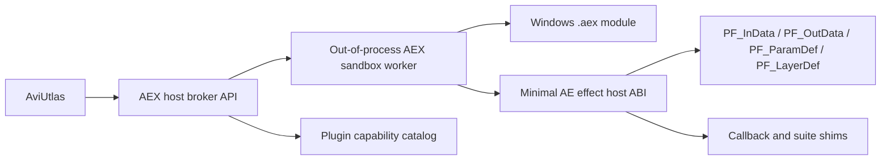

# AEX Direct Host and AEP Edit Strategy - 2026-05-31

Purpose: record the updated user direction for the After Effects lane. The new
target is direct `.aex` hosting where feasible, plus external-tool editing of
`.aep` / `.aepx` projects as freely as can be done safely.

This supersedes the earlier "AE-mediated only" policy wherever the two
conflict. The older snapshot JSON + JSX route remains valuable as a fallback,
validation path, and lower-risk export path.

Structured goal note: the active goal API can only mark the goal `complete` or
`blocked`; it cannot rewrite the objective text. This document and
`GOAL_ORCHESTRATION_ADDENDUM_2026-05-31.md` are therefore the canonical
correction layer for the changed requirement.

## Updated Direction

- Primary new target: direct `.aex` hosting.
- Secondary target: edit `.aep` / `.aepx` projects through an external tool.
- In this plan, "direct `.aex` hosting" means broker-mediated,
  out-of-process worker hosting behind allowlist, identity revalidation, and
  sandbox preflight gates. It does not mean loading `.aex` in the AviUtlas GUI,
  the broker CLI, or an OFX host process.
- This support thread owns feasibility, safety, cleanroom policy, inventory,
  risk analysis, and prompts. The separate AviUtlas development chat owns
  direct application implementation unless explicitly redirected.
- Read-only inventory is allowed for local assets. Do not move, delete,
  overwrite, publish, or copy private Adobe assets without explicit permission.

## Current Evidence

Local inventory under `D:\Projects\01_Project` found:

| Extension | Count | Bytes |
| --- | ---: | ---: |
| `.aep` | 215 | 2,995,633,216 |
| `.aepx` | 1 | 174,352 |
| `.aex` | 40 | 64,745,984 |
| `.jsx` | 10 | 46,009 |
| `.ffx` | 0 | 0 |
| `.auf` | 69 | 10,152,448 |
| `.exo` | 42 | 2,824,054 |

The corresponding local-only metadata artifact is:

- `analysis/AE_AEX_AEP_STATIC_INVENTORY_2026-05-31.md`
- `analysis/AE_AEX_AEP_STATIC_INVENTORY_2026-05-31.json`

The first executable-facing probe should be an image tool, not UI integration:

- `analysis/AEX_IMAGE_PROBE_TOOL_SPEC_2026-05-31.md`
- `analysis/AEX_STATIC_CLASSIFIER_RUNBOOK_2026-05-31.md`
- `analysis/EXTERNAL_EFFECT_CAPABILITY_SCHEMA_2026-05-31.md`

The future OFX route is tracked separately:

- `analysis/OFX_AEX_BRIDGE_STRATEGY_2026-05-31.md`

The project-editing contract is tracked separately:

- `analysis/AEPX_JSX_PATCH_TOOL_SPEC_2026-05-31.md`
- `analysis/AEPX_PATCH_REQUEST_SCHEMA_2026-05-31.json`
- `analysis/JSX_TRANSACTION_REQUEST_SCHEMA_2026-05-31.json`
- `analysis/AEPX_JSX_PATCH_DEVELOPMENT_HANDOFF_2026-05-31.md`

Local self-built `.aex` experiment outputs already exist:

- `D:\Projects\01_Project\05_other\AviUtlas_exedit_for_ae\experiments\ae-timeline-sync\aegp-plugin\build-aegp\AeTimelineSyncAEGP.aex`
- `D:\Projects\01_Project\05_other\AviUtlas_exedit_for_ae\experiments\exedit-ae-remote\aegp-client\build-aegp\ExEditRemoteAEGP.aex`

Local experiment notes show both are AEGP-style AE controller/sync plug-ins
using `EntryPointFunc`, command registration, idle hooks, and named-pipe
transport. They are useful evidence for AE SDK build/deploy mechanics, but they
are not the first direct-host target.

Sidecar feasibility review confirmed this distinction: both self-built local
`.aex` outputs have AEGP PiPLs, so they should not be treated as classic effect
render fixtures. The first render fixture needs to be a legacy/classic CPU
effect plug-in, preferably self-built or SDK-sample-derived under local-only
license review.

Public API facts checked on 2026-05-31:

- Adobe's AE developer site documents plug-ins, scripts, panels, and command
  line development entry points.
- The public AE plug-in guide describes effect plug-in entry point dispatch
  using command selectors and structures such as `PF_InData`, `PF_OutData`,
  `PF_ParamDef[]`, and `PF_LayerDef`.
- The public guide also warns that third-party hosts commonly support only a
  subset of AE plug-in behavior, and that SmartFX / AEGP support is not a given.
- Adobe's supported-format page lists `.aep`, `.aepx`, and `.aet` as After
  Effects project formats.
- The public scripting guide documents command-line script execution and
  project save operations such as `app.project.save(...)`.

Sources:

- <https://developer.adobe.com/after-effects/>
- <https://ae-plugins.docsforadobe.dev/effect-basics/entry-point/>
- <https://ae-plugins.docsforadobe.dev/effect-basics/command-selectors/>
- <https://ae-plugins.docsforadobe.dev/intro/third-party-plug-in-hosts/>
- <https://ae-plugins.docsforadobe.dev/intro/pipl-resources/>
- <https://helpx.adobe.com/se/after-effects/kb/supported-file-formats.html>
- <https://ae-scripting.docsforadobe.dev/introduction/overview/>
- <https://ae-scripting.docsforadobe.dev/general/project/>

## Direct AEX Hosting Scope

First-class target:

- Legacy CPU effect plug-ins that can describe parameters and render a test
  frame through classic effect selectors.

Deferred targets:

- SmartFX effects.
- GPU effects.
- AEGP plug-ins.
- AEIO/import/export plug-ins.
- Artisan/render pipeline extensions.

Reason: effect plug-ins have the clearest host-call surface for a non-Adobe
third-party host. AEGP plug-ins expect AE-like PICA suites, project state,
command hooks, menu registration, idle lifecycle, and broader host services.

## First Direct-Host Milestone

The first milestone should not be "load every `.aex`". It should be:

1. Static catalog without executing code.
2. Sandbox loader for self-built or explicitly allowlisted fixtures only.
3. Minimal CPU effect host for synthetic 8-bit RGBA frames.
4. Capability matrix per plug-in.
5. AviUtlas integration as an opt-in external effect route.
6. OFX adapter around the same worker after the image probe is proven.

Current no-load handoff state:

- `aex_loader_slice_review_packet` is the final JSON-only handoff artifact
  before any separate loader implementation review slice.
- It joins the fixture review gate, loader implementation manifest, and no-load
  provenance audit, redacts private plug-in paths/candidate paths, and keeps
  loader approval, loader enablement, real AEX load enablement, worker plug-in
  load, render, and OFX route permissions false.
- The current checked-in fixture gate is still `review_queue_not_approved`, so
  the handoff remains blocked against current data until a local-only
  `approved-local-only` fixture selection is explicitly recorded.
- A ready packet is not loader approval; it is only evidence that the next
  implementation chat may start a separately reviewed loader slice after
  explicit user approval and license/cleanroom/worker-isolation review.
- `aex_loader_approval_receipt` is the explicit approval validator after that
  handoff. It can accept an operator receipt only for opening a separate loader
  implementation review slice; it still keeps native load, worker plug-in load,
  render, and OFX route permissions false.
- Its draft-template mode emits only unapproved templates from ready sanitized
  packets, so a generated template cannot become approval by itself.

## Required Process Boundary

Direct hosting must mean sandboxed external hosting, not loading arbitrary
third-party `.aex` binaries into the AviUtlas process.

Minimum boundary:

- separate worker executable;
- explicit allowlist for plug-in paths;
- launch timeout and render timeout;
- crash isolation;
- IPC protocol with bounded payload sizes;
- pixel buffers passed through files/shared memory with size checks;
- capability and crash logs that avoid embedding private binary payloads;
- no hidden project file writes;
- no broad network access by default.

Optional hardening:

- Windows Job Object limits;
- restricted token / low-integrity process;
- per-plug-in working directory;
- deny-by-default file access broker for future hardening.

## Phase 0: Static Catalog

Do not execute plug-in code.

Record metadata only:

- path;
- extension;
- size;
- modified time;
- whether the file is self-built, SDK sample, or user/third-party asset;
- PE machine type if cheaply available;
- exports if safely available through tooling;
- PiPL/resource metadata if readable without executing code;
- likely class: `effect`, `aegp`, `aeio`, `unknown`.

No content hashes by default. Avoid copying or publishing local binary payloads.

## Phase 1: Sandbox Loader

Only allow self-built test plug-ins or user-explicit allowlisted plug-ins.

Goals:

- start worker;
- load module;
- find effect entry point where applicable;
- run the smallest safe setup selector sequence;
- return structured success/failure/crash/unsupported status.

Do not run third-party/user-installed `.aex` binaries until the worker timeout,
crash isolation, and logging behavior are verified.

## Phase 2: Minimal CPU Effect Host

Initial supported surface:

- `PF_InData`;
- `PF_OutData`;
- `PF_ParamDef[]`;
- `PF_LayerDef`;
- classic selectors such as global setup and parameter setup;
- frame/sequence setup and teardown selectors;
- render selector for synthetic 8-bit RGBA input/output.

Minimal callback/suite shims should cover memory/handle allocation, parameter
definition/check-in, input/output effect worlds, progress/abort callbacks, and
explicit unsupported-suite reporting. Missing suites should become capability
matrix entries rather than faked AE behavior.

Explicitly unsupported at first:

- SmartFX;
- GPU paths;
- UI dialogs;
- arbitrary data blocks beyond simple parameter metadata;
- audio;
- layer checkout/project/camera APIs;
- AEGP suites;
- direct AE project mutation.

## Phase 3: Capability Matrix

Each plug-in should be classified by:

- static type;
- setup support;
- parameter enumeration support;
- render support;
- required suites/callbacks;
- unsupported selector encountered;
- crash/timeout status;
- publication/license status;
- fixture status.

Unsupported plug-ins remain metadata-only placeholders rather than failures of
the whole project.

## Phase 4: AviUtlas Integration

Expose direct-hosted `.aex` as external effects behind explicit opt-in:

- never load third-party `.aex` in-process;
- cache capability records;
- allow placeholder preservation when host support is missing;
- make render failures non-destructive and visible;
- keep deterministic synthetic tests separate from private user plug-ins.

## AEP / AEPX Editing Direction

Binary `.aep` writing is not the first target.

Preferred editing tracks:

### Track A: AEPX Patch Editor

Use `.aepx` XML as the direct structural editing format where available.

Detailed v0 contract:

- `analysis/AEPX_PATCH_REQUEST_SCHEMA_2026-05-31.json`

First safe operations:

- read project metadata;
- rename comps;
- rename layers;
- edit comments/markers;
- replace simple text source strings;
- relink asset paths through explicit user-chosen paths;
- preserve unknown nodes and attributes byte-for-byte where possible.

Write output to a new file path. Validate by opening/saving in AE when
available. Never overwrite the original without explicit permission.

### Track B: JSX Patch Runner

Represent edits as neutral JSON patch/IR, generate JSX, and let After Effects
apply the patch and save.

Detailed v0 contract:

- `analysis/JSX_TRANSACTION_REQUEST_SCHEMA_2026-05-31.json`

This is the safest path for binary `.aep`:

1. User selects source `.aep`.
2. External tool generates an edit script from a neutral patch.
3. AE opens the project, applies edits, and saves to a new output path.
4. Tool records warnings and unsupported operations.

JSX must avoid shell/system calls by default and should use `app.project.save`
only for explicit output paths.

Automated v0 tests should generate and scan JSX, but should not launch After
Effects. AE execution remains an explicit manual-smoke step.

Current gate note: the request-pair approval route now carries optional AEPX
dry-run evidence from `ae_project_edit_review_packet` into
`ae_project_edit_approval`. When that evidence is present, the approval receipt
must acknowledge it with `aepx_dry_run_reviewed=true`, while the validator still
requires `aepx_dry_run_accepted_as_apply=false` and
`allow_aepx_write_without_preservation_proof=false`. This keeps AEPX dry-run
evidence reviewable without authorizing XML writes.

### Track C: Binary AEP Probe

Read-only metadata probes are allowed only for high-level orientation. Do not
write binary `.aep` until the file format and legal/safety posture are proven.

## Immediate Agent Lanes

1. AEX Static Catalog Agent: read-only inventory and classification of local
   `.aex` files, with self-built vs third-party separation.
2. AEX Sandbox Host Design Agent: minimal ABI, IPC, timeout, crash isolation,
   and selector subset.
3. AEPX Patch Editor Agent: first safe XML patch operations plus JSX patch
   runner contract.

## Safety Position

Do:

- treat direct `.aex` hosting as a real target;
- start with static metadata and self-built fixtures;
- keep hosting out-of-process;
- keep `.aepx`/JSX as the first editable project path;
- preserve private assets and binary payloads.

Do not:

- load arbitrary `.aex` binaries into AviUtlas;
- claim SmartFX/AEGP support before suite compatibility exists;
- write binary `.aep` files directly in the first iteration;
- copy local `.aep`, `.aex`, `.ffx`, or user project data into public fixtures;
- mark the whole goal complete because this correction document exists.
