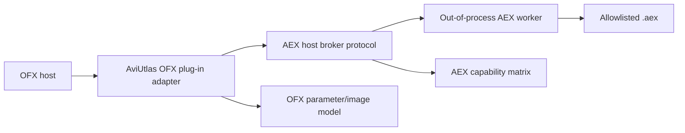

# OFX / AEX Bridge Strategy - 2026-05-31

Purpose: capture the user's idea that it would be useful if `.aex` could
eventually be used through an OFX route.

The strongest direction is not to make OFX load `.aex` directly in-process.
Instead, treat OFX as an adapter layer around the same out-of-process AEX worker
used by `aex-image-probe`.

OFX remains deferred: it may only be a later facade over the same broker/worker/sandbox contract,
using the same allowlist, loader approval, worker identity revalidation, and sandbox preflight gates.
It must not bypass those gates, must not load `.aex` inside an OFX host process,
and must not become AviUtlas's route to AEX.

Sidecar review confirmed the division:

- AviUtlas should call the AEX broker directly.
- External OFX hosts can later use an OFX facade that calls the same worker.
- Do not route AviUtlas through `AviUtlas -> OFX -> AEX` for the first native
  integration.
- Do not load `.aex` inside the OFX host process.

## Target Shape

This lets an OFX host see an OFX plug-in, while the actual `.aex` remains behind
the same sandbox/capability boundary as the native AviUtlas integration.

## Why OFX Is Useful

- OFX is a host-neutral plug-in shape for image/video effects.
- An OFX adapter could make the AEX worker usable outside AviUtlas.
- It encourages a clean effect contract: image in, params in, image out,
  capability report, no hidden project mutation.
- It can reuse the `aex-image-probe` still-image path as the first smoke test.

## Why OFX Should Not Be The First Loader

- Direct AEX hosting already requires AE-specific ABI shims.
- OFX adds another host ABI and another plug-in packaging surface.
- If OFX is the first implementation, failures become ambiguous: AEX host bug,
  OFX host bug, or adapter bug.
- The safer sequence is AEX worker first, OFX adapter second.

## Phased Plan

### Phase 0: Shared Capability Model

Create a common capability record used by:

- static AEX inventory;
- `aex-image-probe`;
- AviUtlas external effect integration;
- future OFX adapter.

Schema artifact:

- `analysis/EXTERNAL_EFFECT_CAPABILITY_SCHEMA_2026-05-31.md`
- `analysis/EXTERNAL_EFFECT_CAPABILITY_SCHEMA_2026-05-31.json`
- `analysis/OFX_AEX_FACADE_CONTRACT_2026-05-31.json`

Local repo note: the existing plugin bridge already has frame-buffer and shared
frame layout concepts that a future worker contract can align with. Do not reuse
or edit those hot runtime paths from this support thread without explicit
development ownership.

Important fields:

- plugin identity;
- plugin class;
- parameter descriptors;
- supported pixel formats;
- required suites;
- unsupported selectors;
- crash/timeout history;
- license/publication status.

### Phase 1: AEX Image Probe

Implement `aex-image-probe` first:

- one frame;
- RGBA8;
- allowlisted local-build plug-in;
- out-of-process worker;
- JSON report;
- no OFX dependency.

This establishes the worker boundary and image transport.

### Phase 2: AviUtlas Native External Effect

Use the same broker protocol from AviUtlas:

- render current frame through worker;
- cache capability records;
- preserve unsupported `.aex` as placeholders;
- never load `.aex` in-process.

### Phase 3: OFX Adapter

Build an OFX plug-in that exposes one or more AEX-backed effects to OFX hosts.

The OFX adapter should:

- translate OFX image clips to the worker image buffer contract;
- translate OFX parameters to the worker param JSON;
- report unsupported AEX features as disabled parameters or host messages;
- call the worker with timeouts;
- surface render failures non-destructively.

### Phase 4: OFX Host In AviUtlas

Separately, AviUtlas may eventually host native OFX plug-ins. That is a larger
feature and should not be conflated with AEX-through-OFX. Two directions exist:

- AviUtlas as an OFX host for normal OFX plug-ins.
- AviUtlas or another OFX host using an OFX adapter that wraps the AEX worker.

Keep these separate in docs and code.

## Mapping Notes

Image model:

- initial shared format: RGBA8;
- later: RGBA16/float if AEX worker supports it;
- OFX regions of interest can map to AEX extent/output-extent only after the
  full-frame path is stable.

Time model:

- still image first: time `0`;
- video frame later: integer frame plus rational frame rate;
- avoid AE project time assumptions in the OFX adapter.

Parameter model:

- simple scalar/color/point/checkbox first;
- popup/string/path later;
- custom UI, layer selectors, camera/light, and arbitrary data deferred.

Error model:

- unsupported selector/suite -> OFX message and disabled render path;
- worker crash -> OFX render failure without host crash;
- timeout -> OFX render failure plus capability warning;
- parameter mismatch -> validation error before worker launch.

## Risks

- Licensing: OFX SDK/header license and any adapter dependency must be audited
  before code import.
- Safety: an OFX host must not become a way to bypass the AEX worker allowlist.
- Fidelity: OFX and AE parameter/time semantics do not match perfectly.
- Packaging: shipping an OFX adapter that depends on private/local `.aex` files
  is not a public distribution strategy.

## Recommended Next Prompt

> Design the shared `EffectWorkerCapability` schema for AEX image probe,
> AviUtlas external effect integration, and future OFX adapter. Include parameter
> descriptor types, pixel format support, selector/suite support, crash/timeout
> history, license/publication status, and host notes. Do not implement OFX yet.

## Near-Term Decision

Treat OFX as a bridge layer after the AEX worker is real. The immediate useful
tool is `aex-image-probe`; OFX becomes valuable once the worker can describe and
render at least one local-build classic CPU effect.

## 2026-06-01 Roadmap Update

The `aex-image-probe` mini-tool path is now the right place to make AEX
experiments concrete:

1. keep the broker/worker request contract useful as an image-apply harness;
2. harden sandbox approval and worker-side revalidation while real loading
   remains disabled;
3. enable exactly one reviewed local-build classic CPU fixture in the worker;
4. produce a real one-frame PNG render report;
5. wrap the same broker/worker protocol from an OFX adapter for external OFX
   hosts.

Do not make OFX the first AEX loader, and do not make AviUtlas route through
OFX to use AEX. The OFX adapter should be a facade over the measured
broker/worker path.

## 2026-06-01 Contract Update

`analysis/OFX_AEX_FACADE_CONTRACT_2026-05-31.json` freezes the no-bypass
contract in machine-checkable form. The current status is
`deferred-contract-only`: no OFX operations are implemented, no OFX SDK/header
code is vendored, and no host or adapter process may load `.aex`.

Any future OFX adapter must use the same AEX allowlist, loader approval, worker
identity revalidation, sandbox preflight, worker attestation, Job Object
kill-on-close, and `sentinel_not_inherited-with-explicit-handle-list` gate as
the direct AEX broker path. A passed OFX facade contract is not loader approval
and must not flip `loader_approval.approved`, `loader_enabled`, or
`real_aex_load_enabled`.

## 2026-06-01 Readiness Planner Update

`aviutl-rs/examples/ofx_aex_facade_readiness.rs` now turns the no-bypass
contract into a generated local report. It consumes:

- `analysis/OFX_AEX_FACADE_CONTRACT_2026-05-31.json`
- `analysis/AEX_FIXTURE_REVIEW_GATE_2026-05-31.json`
- generated `loader-gate.local.json`
- generated `capabilities/*.capability.json`

The current output, `target/aex-ofx-facade-readiness/ofx-facade.local.json`,
reports `status=deferred_contract_only`, `ofx_host_may_load_aex=false`,
`ofx_adapter_may_load_aex=false`, `broker_may_load_aex=false`,
`supported_capability_count=0`, and
`render_png_exposure=blocked_loader_gate_closed`.

The generated report shape is now pinned by
`analysis/OFX_AEX_FACADE_READINESS_REPORT_SCHEMA_2026-06-01.json` and the
focused `ofx_aex_facade_readiness_contract` test. The schema is intentionally
closed around readiness metadata and no-bypass proof, not a promise that an OFX
adapter or host route exists.

The planner can now also consume the no-load native stage plan report. When it
does, the OFX readiness output includes `native_stage_plan_summary`, a compact
set of derived facts proving the stage plan stayed no-load, runtime evidence
remained satisfied, selector/render execution stayed blocked, and OFX routing
remained false. The summary is evidence only. It does not let OFX become the
first AEX loader, does not point an OFX adapter at the broker, and does not
authorize describe or render requests.

The planner can also consume the sanitized loader-slice review packet through
`--loader-slice-review-packet`. It reads only status and boolean no-load facts
from the packet, publishes them under `loader_slice_review_summary`, and rejects
packets that claim loader approval, enabled loading, worker plug-in loading,
rendering, or OFX routing. Private/local plug-in paths and `.aex` filenames are
treated as contamination and are not echoed into the OFX readiness report. A
ready loader-slice packet changes `render_png_exposure` only to
`blocked_pending_separate_ofx_review`; it still does not authorize describe,
render, broker calls, or OFX routing.

The planner can now additionally consume the sanitized
`aex_loader_approval_receipt` validation report through
`--loader-approval-report`. It summarizes only the approval validation status,
receipt effect booleans, blocked-reason count, and no-load/runtime permission
flags. A report accepted as
`approved_for_loader_implementation_review_no_load` is treated only as evidence
that a separate loader implementation review may begin; it still does not open
OFX route, describe, render, broker, worker, or native AEX permissions. Reports
that mention route/render permission, loader/native execution, worker loading,
private paths, or `.aex` filenames fail closed and are not echoed.

The planner can also consume the parent metadata gate integration report through
`--aex-metadata-gate-report`. It publishes only
`aex_metadata_gate_summary`: a compact view of the ready
`aex_metadata_gate_ready_no_load` boundary, fixture/loader closed facts,
identity-smoke no-load facts, and deferred OFX contract facts. This input is
not OFX approval. Ready metadata leaves the OFX report
`deferred_contract_only`; drift toward native `.aex` load, AEX render
correctness, AE invocation, private payload copy, or OFX routing blocks as
`blocked_contract_mismatch`.

CLI report output is now bounded as a publication artifact:
`--out` must be a `.json` file under `target/aex-ofx-facade-readiness`, must not
contain traversal components, and must pass a canonical parent containment check
immediately before writing. The writer uses create-new semantics, so an existing
OFX readiness report is not overwritten.

This planner deliberately does not import OFX SDK headers, build an adapter,
start an OFX host, ask a worker to describe/render, or load `.aex`. It is the
safe join point before any future OFX implementation.

## 2026-06-01 Review Gate Update

The OFX contract and readiness report now carry an explicit
`ofx_facade_review_gate`. It remains closed:

- `approved=false`;
- `may_point_to_broker=false`;
- `may_issue_describe=false`;
- `may_issue_render_png=false`;
- a separate review after the AEX loader gate is still required;
- capability ids must remain a subset of the loader-gate evidence;
- the same shared AEX gates are required.

If the AEX loader gate reports an open candidate count before that OFX review
gate is approved, the OFX readiness report now becomes
`blocked_contract_mismatch` with a reason stating that OFX facade review is
still required before pointing at the AEX broker. This prevents a partial AEX
loader opening from being interpreted as permission for an OFX wrapper to call
the broker.

## 2026-06-01 Provenance Audit Update

`aex_no_load_provenance_audit` now verifies the full metadata chain before any
OFX adapter work can cite it:

- ready loader implementation manifest with semantic readiness evidence;
- ready native stage plan with runtime and cleanroom boundary evidence;
- deferred OFX readiness report that consumed the native-stage summary.

The audit remains JSON-only and reports `ofx_route_allowed=false` even when the
chain is ready. A ready audit is useful as a review packet for sequencing; it
does not point OFX at the broker, does not expose describe/render, and does not
make AviUtlas reach AEX through OFX.
